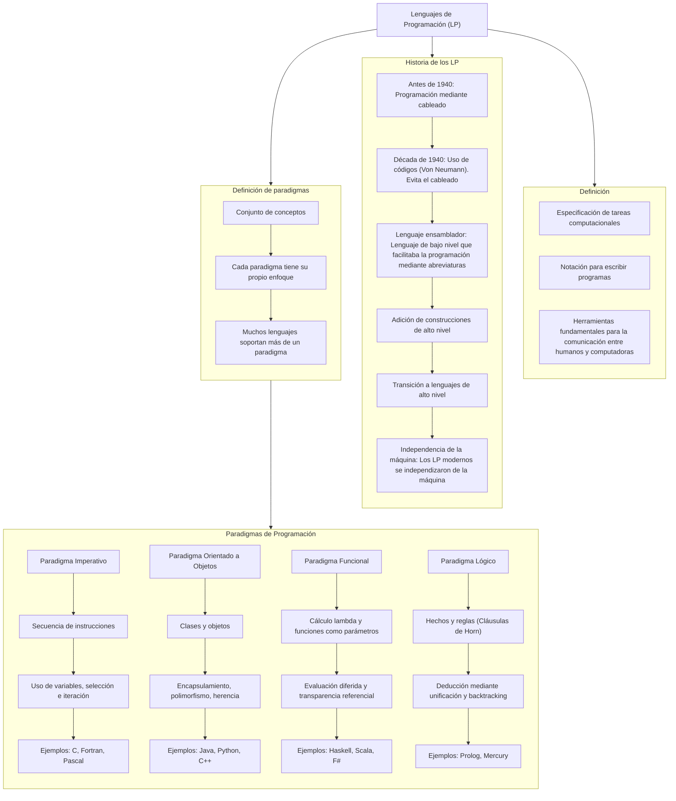

# TP 1


# Características de Lenguajes de Programación


## TP 3 - Lenguaje Backrooms (Esotérico)

Los "Backrooms" son una creepypasta o leyenda urbana que describe un laberinto infinito de cuartos y pasillos de apariencia industrial, normalmente con paredes amarillentas, iluminación artificial y pisos de vinilo. Son descritos como un lugar al que se puede acceder erróneamente desde el mundo real, y que se caracteriza por su naturaleza inquietante y a menudo peligrosa


Este lenguaje está inspirado en esta "leyenda urbana" de las *Backrooms*, diseñado para simular exploración en un espacio infinito y surrealista mediante instrucciones minimalistas.

## Índice
- [Lenguaje Backrooms (Esotérico)](#lenguaje-backrooms-esotérico)
  - [Índice](#índice)
  - [Características](#características)
  - [Gramáticas Formales](#gramáticas-formales)
    - [Gramática Independiente del Contexto (GIC)](#gramática-independiente-del-contexto-gic)
    - [Backus-Naur Form (BNF)](#backus-naur-form-bnf)
    - [Extendad Backus-Naur Form (EBNF)](#extendad-backus-naur-form-ebnf)
    - [Augmented Backus-Naur Form (ABNF)](#augmented-backus-naur-form-abnf)
    - [Semántica y Ejemplos](#semántica-y-ejemplos)
    - [Programa de Ejemplo](#programa-de-ejemplo)
      - [Descripción:](#descripción)
    - [Enlaces:](#enlaces)

---

## Características
- **Movimiento**: `w` (adelante), `a` (izquierda), `s` (atrás), `d` (derecha).
- **Acciones**: 
  - `e` (interactuar).
  - `q` (acción secundaria, como usar un objeto).
- **Estructuras de control**:
  - `[ ]`: Bucles o repeticiones.
  - `{ }`: Bloques condicionales o de eventos.
- **Operadores aritméticos**: `+`, `-`, `*`, `/` (modifican el entorno).
- **Números**: Enteros positivos (ej. `42` para repeticiones).

---

## Gramáticas Formales

### Gramática Independiente del Contexto (GIC)
```gic
<programa>      → <instrucciones>
<instrucciones> → <instruccion> | <instruccion> <instrucciones>
<instruccion>   → <movimiento> | <accion> | <control> | <operacion> | <numero> 
<movimiento>    → w | a | s | d
<accion>        → e | q
<control>       → '[' <instrucciones> ']' | '{' <instrucciones> '}'
<operacion>     → + | - | * | /
<numero>        → <digito> | <digito> <numero>
<digito>        → 0 | ... | 9
```

### Backus-Naur Form (BNF)
```
<programa>      ::= <instrucciones>
<instrucciones> ::= <instruccion> | <instruccion> <instrucciones>
<instruccion>   ::= <movimiento> | <accion> | <control> | <operacion> | <numero> 
<movimiento>    ::= w | a | s | d
<accion>        ::= e | q
<control>       ::= '[' <instrucciones> ']' | '{' <instrucciones> '}'
<operacion>     ::= + | - | * | /
<numero>        ::= <digito> | <digito> <numero>
<digito>        ::= 0 | ... | 9
```
### Extendad Backus-Naur Form (EBNF)
```
programa     ::=  { instruccion } 
instruccion  ::= movimiento | accion | control | operacion | numero
movimiento   ::= w | a | s | d 
accion       ::= e | q 
control      ::= '[' { instruccion } ']' | '{' { instruccion } '}' 
operacion    ::= '+' | '-' | '*' | '/' 
numero       ::= digito { digito } 
digito       ::= 0 | 1 | 2 | 3 | 4 | 5 | 6 | 7 | 8 | 9 
```
### Augmented Backus-Naur Form (ABNF)

```
programa : *instruccion
instruccion : movimiento
              accion
              control
              operacion
              numero
movimiento : %x77
             %x61
             %x73
             %x64  ; #'w', 'a', 's', 'd' en ASCII
accion : uno de %x65 %x71  ; #'e', 'q'
control : "[" *instruccion "]"
          "{" *instruccion "}"
operacion : uno de + - * /
numero : 1*digito
digito : uno de %x30-39  ; #'0'-'9'
```
### Semántica y Ejemplos
Interpretación
[w a s d]: Bucle infinito de movimientos (caminar en círculo).

{e q *}: Ejecuta e, luego q, y aplica una multiplicación al entorno.

3w (extensión propuesta): Avanza 3 veces.

### Programa de Ejemplo
```
w w [a d] e {q * 2}
```
#### Descripción:

Avanza 2 veces (w w).

Entra en un bucle [a d] (izquierda-derecha).

Ejecuta e (interactúa).

Bloque {q * 2}: Usa q y multiplica algo por 2.

## Notas adicionales

- **Backrooms** parece tener una sintaxis minimalista basada en caracteres individuales.
- Los **bloques de control** se representan con `[]` y `{}` según la documentación.
- Las **operaciones matemáticas básicas** están incluidas.
- El **movimiento** usa las teclas WASD típicas en videojuegos.
- Las **acciones** `'e'` y `'q'` representan interacciones especiales.

### Enlaces:

https://rpp.pe/capital/mundo/que-son-los-backrooms-la-pesadilla-que-podria-aterrorizarte-noticias-1435019

https://esolangs.org/wiki/Backrooms

### Árbol Sintáctico


### Diagrama de CONNWAY para "Backrooms"


# TP 5
# Tipos de *Binding* en Parámetros

| **Binding** | **¿Qué define?** | **Estático** | **Dinámico** | **Diferencia entre Estático y Dinámico** | **Ejemplos** |
|-------------|------------------|--------------|--------------|------------------------------------------|-------------|
| **De tipo** | Determina qué tipo de datos puede recibir el parámetro. | El tipo está declarado explícitamente y se verifica en tiempo de compilación. | El tipo se determina automáticamente en tiempo de ejecución, según el valor pasado. | En estático, los errores de tipo se detectan antes de ejecutar. En dinámico, pueden aparecer solo cuando se usa el parámetro. | **Estático**: `int suma(int a, int b)` *(C, Java)*<br>**Dinámico**: `def suma(a, b)` *(Python, JS)* |
| **De valor o referencia** | Define si el parámetro recibe una copia del argumento o una referencia a él. | El paso (por valor o por referencia) se indica en la definición de la función o lo impone el lenguaje. | La forma en que se pasa puede variar según el tipo del argumento o cómo se lo utilice en tiempo de ejecución. | En estático, siempre se comporta igual. En dinámico, el mismo código puede funcionar distinto dependiendo del dato pasado. | **Estático**: `void f(int& x)` *(C++, por referencia)*<br>**Dinámico**: `def f(x): x.append(1)` *(Python, depende si es mutable o inmutable)* |
| **De alcance** | Define en qué partes del programa puede accederse al parámetro. | El parámetro solo es accesible dentro del bloque o función donde fue definido. | El parámetro puede mantenerse accesible fuera de su bloque original, si se captura (ej. en closures). | En estático, el alcance es fijo y limitado. En dinámico, puede extenderse más allá del lugar donde se declaró. | **Estático**: `def f(x): return x + 1` *(Python)*<br>**Dinámico**: `def f(): a = 10; return lambda x: x + a` *(Python, el parámetro `a` vive fuera)* |
| **De almacenamiento** | Especifica dónde (en memoria) se guarda el parámetro durante la ejecución. | La ubicación (pila, registros) es definida por el compilador según reglas del lenguaje. | Puede cambiar dinámicamente si, por ejemplo, el parámetro queda retenido en una función anidada o closure. | En estático, el almacenamiento es previsible. En dinámico, el parámetro puede mantenerse vivo más tiempo y en otra zona de memoria. | **Estático**: parámetros por pila en `int f(int x)` *(C)*<br>**Dinámico**: `def outer(): a = 1; return lambda: a` *(Python, `a` queda en el heap)* |
| **De nombre** | Es el identificador con el que se accede al parámetro dentro del cuerpo de la función. | El nombre está definido al declarar la función y no puede cambiar. | Se puede generar, modificar o usar indirectamente mediante programación dinámica o reflexiva. | En estático, el nombre es fijo. En dinámico, el nombre puede construirse o resolverse en ejecución. | **Estático**: `def saludar(nombre): print(nombre)`<br>**Dinámico**: `globals()['saludo'] = lambda x: print(x)` *(Python, nombre generado)* |
| **De tipo de paso** | Indica la estrategia con la que se pasa el parámetro (valor, referencia, nombre, perezoso, etc.). | Se fija por el lenguaje o en la definición de la función. No varía al llamar. | Se determina en tiempo de ejecución o puede variar según el uso del parámetro. | Estático: el paso es siempre el mismo. Dinámico: puede elegirse o inferirse durante la ejecución. | **Estático**: `int f(int x)` *(C, por valor)*<br>**Dinámico**: `let x = lazy (f())` *(OCaml, evaluación diferida/perezosa)* |


##Ejemplos de Binding: 

Binding de Alcance (Scope Binding):

Estático: El valor de una variable se resuelve en tiempo de compilación o antes de la ejecución, basándose en la ubicación léxica del código.
```
def f(x):
    return x + 1
```
Dinámico: El valor de una variable se resuelve en tiempo de ejecución, basándose en el contexto de llamada.

```
def f():
    a = 10
    return lambda x: x + a # La variable 'a' vive fuera de la función lambda
```
Binding de Almacenamiento (Storage Binding):

Dinámico: La variable se almacena en el heap y su vida útil se extiende más allá de la función que la define.

```
def outer():
    a = 1
    return lambda: a # 'a' permanece en el heap y es accesible por la lambda
```
Binding de Nombre (Name Binding):

Dinámico: El nombre de una variable o función es generado o asociado en tiempo de ejecución.

```
globals()['saludo'] = lambda x: print(x) #El nombre 'saludo' se genera dinámicamente
```
# Lenguaje de Programación a Lenguaje Natural
## Lenguaje de Programación: "Caminante"
Imagina que tu código es un "Caminante", una entidad que se mueve a través de los infinitos y extraños Backrooms. Este lenguaje, llamado "Caminante", te permite darle instrucciones a este caminante para interactuar con los Niveles y las Entidades que habitan este laberinto. Cada instrucción se asemeja a una acción que tomarías o una observación que harías dentro de los Backrooms.

Con "Caminante", puedes hacer lo siguiente:

Expresiones (Detección y Manipulación de Atributos): Puedes "detectar" o "establecer" atributos de tu entorno o de ti mismo. Por ejemplo, puedes decir "detecta 'humedad' en el Nivel actual" o "establece 'resistencia' a 50". El lenguaje procesará estas detecciones o asignaciones, dándote información o modificando características.

Condicionales (Decisiones de Supervivencia): Puedes hacer que tu caminante tome decisiones críticas. Si se cumple una condición ("hay una Entidad cerca"), realizará una acción ("huye"); si no, hará otra ("continúa explorando"). Por ejemplo: "Si 'peligro_cercano' es 'verdadero', entonces 'corre al Nivel_Seguro', si no, 'busca suministros'".

Iteración (Patrullas y Búsquedas Repetitivas): Puedes ordenar al caminante que repita una acción un número específico de veces o hasta que una condición deje de cumplirse (o se cumpla). Por ejemplo: "Recorre el Nivel 10 veces: 'escanear_paredes'" o "Mientras 'salida_no_encontrada' sea 'verdadera', 'muévete_aleatoriamente'".

Tipos de Datos (Los Elementos de los Backrooms)
"Caminante" entiende y maneja al menos dos tipos fundamentales de información, cruciales para navegar los Backrooms:

Niveles/Cantidades (Numéricos): Representan los distintos Niveles de los Backrooms (0, 1, 2, etc.) o cantidades como "estabilidad" o "recuentos". Por ejemplo: 0, 999, 3.14.

Atributos/Entidades (Cadenas de Texto): Son descripciones de propiedades ("'iluminación'"), nombres de Entidades ("'Sonriente'"), o estados ("'seguro'"). Siempre van entre comillas. Por ejemplo: "Nivel_Infinito", "olor_a_humedad", "Parásito".

## Gramática BNF (Backus-Naur Form) para "Caminante"

```
<programa> ::= <instruccion> | <instruccion> <programa>

<instruccion> ::= <declaracion_atributo>
                | <evaluacion_condicional>
                | <ciclo_exploracion>
                | <accion_basica>

<declaracion_atributo> ::= "establece" <variable> "a" <valor>
                         | "detecta" <atributo_backroom> "en" <lugar> "y guarda en" <variable>

<valor> ::= <numero>
          | <cadena_texto>
          | <variable>
          | <expresion_numerica>

<expresion_numerica> ::= <numero>
                       | <variable>
                       | <expresion_numerica> "mas" <expresion_numerica>
                       | <expresion_numerica> "menos" <expresion_numerica>
                       | <expresion_numerica> "multiplicado_por" <expresion_numerica>
                       | <expresion_numerica> "dividido_por" <expresion_numerica>
                       | "(" <expresion_numerica> ")"

<evaluacion_condicional> ::= "si" <condicion_backroom> "," "entonces" <programa> "sino," <programa>
                           | "si" <condicion_backroom> "," "entonces" <programa>

<condicion_backroom> ::= <variable> "es" <valor>
                       | <atributo_backroom> "es" <cadena_texto>
                       | <numero> "es_mayor_que" <numero>
                       | <entidad> "esta_presente_en" <lugar>

<ciclo_exploracion> ::= "repite" <numero> "veces" ":" <programa>
                      | "mientras" <condicion_backroom> ":" <programa>

<accion_basica> ::= "mover" <direccion>
                  | "interactuar_con" <entidad>
                  | "manifestar" <valor>
                  | "transicionar_a" <lugar>

<numero> ::= <digito> | <numero> <digito> | <numero> "." <digito>
<digito> ::= "0" | "1" | "2" | "3" | "4" | "5" | "6" | "7" | "8" | "9"

<cadena_texto> ::= "\"" <caracteres> "\""
<caracteres> ::= <caracter> | <caracter> <caracteres>
<caracter> ::= (cualquier letra, número, o símbolo excepto "\"")

<variable> ::= <letra> | <variable> <letra> | <variable> <digito> | <variable> "_"
<letra> ::= "a"..."z" | "A"..."Z"

<atributo_backroom> ::= "iluminacion" | "humedad" | "ruido" | "estabilidad_nivel" | <cadena_texto>

<lugar> ::= "Nivel_" <numero> | "Nivel_actual" | "zona_segura" | <variable>

<entidad> ::= "Sonriente" | "Sabueso" | "Limen" | "Parásito" | <cadena_texto>

<direccion> ::= "adelante" | "atras" | "izquierda" | "derecha"
```

## Ejemplo de Programa en "Caminante":
```
detecta "iluminacion" en Nivel_actual y guarda en luz_actual
si luz_actual es "baja", entonces
  manifestar "¡Oscuridad! Buscando una fuente de luz."
  repite 5 veces:
    mover adelante
    detecta "ruido" en Nivel_actual y guarda en ruido_detectado
    si ruido_detectado es "alto", entonces
      manifestar "¡Ruido sospechoso! Podría haber una Entidad."
      interactuar_con "Sonriente"
      si "Sonriente" esta_presente_en Nivel_actual, entonces
        transicionar_a Nivel_0
      sino,
        manifestar "Falsa alarma. Continuando."
sino,
  manifestar "Nivel bien iluminado. Explorando con cautela."
  mientras estabilidad_nivel es_mayor_que 10:
    establece "estabilidad_nivel" a estabilidad_nivel menos 1
    manifestar "Disminuyendo estabilidad..."
```

