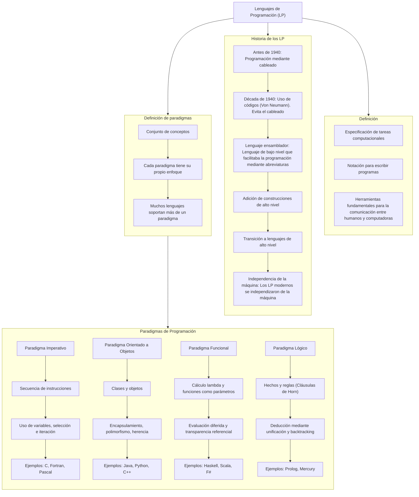

# Características de Lenguajes de Programación

# TP 1



## TP 3 - Lenguaje Backrooms (Esotérico)

Los "Backrooms" son una creepypasta o leyenda urbana que describe un laberinto infinito de cuartos y pasillos de apariencia industrial, normalmente con paredes amarillentas, iluminación artificial y pisos de vinilo. Son descritos como un lugar al que se puede acceder erróneamente desde el mundo real, y que se caracteriza por su naturaleza inquietante y a menudo peligrosa


Este lenguaje está inspirado en esta "leyenda urbana" de las *Backrooms*, diseñado para simular exploración en un espacio infinito y surrealista mediante instrucciones minimalistas.

## Índice
- [Lenguaje Backrooms (Esotérico)](#lenguaje-backrooms-esotérico)
  - [Índice](#índice)
  - [Características](#características)
  - [Gramáticas Formales](#gramáticas-formales)
    - [Gramática Independiente del Contexto (GIC)](#gramática-independiente-del-contexto-gic)
    - [Backus-Naur Form (BNF)](#backus-naur-form-bnf)
    - [Extendad Backus-Naur Form (EBNF)](#extendad-backus-naur-form-ebnf)
    - [Augmented Backus-Naur Form (ABNF)](#augmented-backus-naur-form-abnf)
    - [Semántica y Ejemplos](#semántica-y-ejemplos)
    - [Programa de Ejemplo](#programa-de-ejemplo)
      - [Descripción:](#descripción)
    - [Enlaces:](#enlaces)

---

## Características
- **Movimiento**: `w` (adelante), `a` (izquierda), `s` (atrás), `d` (derecha).
- **Acciones**: 
  - `e` (interactuar).
  - `q` (acción secundaria, como usar un objeto).
- **Estructuras de control**:
  - `[ ]`: Bucles o repeticiones.
  - `{ }`: Bloques condicionales o de eventos.
- **Operadores aritméticos**: `+`, `-`, `*`, `/` (modifican el entorno).
- **Números**: Enteros positivos (ej. `42` para repeticiones).

---

## Gramáticas Formales

### Gramática Independiente del Contexto (GIC)
```gic
<programa>      → <instrucciones>
<instrucciones> → <instruccion> | <instruccion> <instrucciones>
<instruccion>   → <movimiento> | <accion> | <control> | <operacion> | <numero> | <numero> <operacion>
<movimiento>    → w | a | s | d
<accion>        → e | q
<control>       → '[' <instrucciones> ']' | '{' <instrucciones> '}'
<operacion>     → + | - | * | /
<numero>        → <digito> | <digito> <numero>
<digito>        → 0 | ... | 9
```

### Backus-Naur Form (BNF)
```
<programa>      ::= <instrucciones>
<instrucciones> ::= <instruccion> | <instruccion> <instrucciones>
<instruccion>   ::= <movimiento> | <accion> | <control> | <operacion> | <numero> | <numero> <operacion>
<movimiento>    ::= w | a | s | d
<accion>        ::= e | q
<control>       ::= '[' <instrucciones> ']' | '{' <instrucciones> '}'
<operacion>     ::= + | - | * | /
<numero>        ::= <digito> | <digito> <numero>
<digito>        ::= 0 | ... | 9
```
### Extendad Backus-Naur Form (EBNF)
```
programa     ::=  { instruccion } 
instruccion  ::= movimiento | accion | control | operacion 
movimiento   ::= w | a | s | d 
accion       ::= e | q 
control      ::= '[' { instruccion } ']' | '{' { instruccion } '}' 
operacion    ::= '+' | '-' | '*' | '/' | <numero> | <numero> <operacion>
numero       ::= digito { digito } 
digito       ::= 0 | 1 | 2 | 3 | 4 | 5 | 6 | 7 | 8 | 9 
```
### Augmented Backus-Naur Form (ABNF)

```
programa : *instruccion
instruccion : movimiento
              accion
              control
              operacion
movimiento : %x77
             %x61
             %x73
             %x64  ; #'w', 'a', 's', 'd' en ASCII
accion : uno de %x65 %x71  ; #'e', 'q'
control : "[" *instruccion "]"
          "{" *instruccion "}"
operacion : uno de + - * /
numero : 1*digito
digito : uno de %x30-39  ; #'0'-'9'
```
### Semántica y Ejemplos
Interpretación
[w a s d]: Bucle infinito de movimientos (caminar en círculo).

{e q *}: Ejecuta e, luego q, y aplica una multiplicación al entorno.

3w (extensión propuesta): Avanza 3 veces.

### Programa de Ejemplo
```
w w [a d] e {q * 2}
```
#### Descripción:

Avanza 2 veces (w w).

Entra en un bucle [a d] (izquierda-derecha).

Ejecuta e (interactúa).

Bloque {q * 2}: Usa q y multiplica algo por 2.

## Notas adicionales

- **Backrooms** parece tener una sintaxis minimalista basada en caracteres individuales.
- Los **bloques de control** se representan con `[]` y `{}` según la documentación.
- Las **operaciones matemáticas básicas** están incluidas.
- El **movimiento** usa las teclas WASD típicas en videojuegos.
- Las **acciones** `'e'` y `'q'` representan interacciones especiales.

### Enlaces:

https://rpp.pe/capital/mundo/que-son-los-backrooms-la-pesadilla-que-podria-aterrorizarte-noticias-1435019

https://esolangs.org/wiki/Backrooms


### Diagrama de CONNWAY para "Backrooms"


