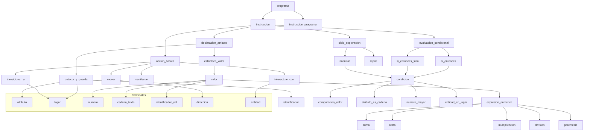

# TP 1


# Características de Lenguajes de Programación


## TP 3 - Lenguaje Backrooms (Esotérico)

Los "Backrooms" son una creepypasta o leyenda urbana que describe un laberinto infinito de cuartos y pasillos de apariencia industrial, normalmente con paredes amarillentas, iluminación artificial y pisos de vinilo. Son descritos como un lugar al que se puede acceder erróneamente desde el mundo real, y que se caracteriza por su naturaleza inquietante y a menudo peligrosa


Este lenguaje está inspirado en esta "leyenda urbana" de las *Backrooms*, diseñado para simular exploración en un espacio infinito y surrealista mediante instrucciones minimalistas.

## Índice
- [Lenguaje Backrooms (Esotérico)](#lenguaje-backrooms-esotérico)
  - [Índice](#índice)
  - [Características](#características)
  - [Gramáticas Formales](#gramáticas-formales)
    - [Gramática Independiente del Contexto (GIC)](#gramática-independiente-del-contexto-gic)
    - [Backus-Naur Form (BNF)](#backus-naur-form-bnf)
    - [Extendad Backus-Naur Form (EBNF)](#extendad-backus-naur-form-ebnf)
    - [Augmented Backus-Naur Form (ABNF)](#augmented-backus-naur-form-abnf)
    - [Semántica y Ejemplos](#semántica-y-ejemplos)
    - [Programa de Ejemplo](#programa-de-ejemplo)
      - [Descripción:](#descripción)
    - [Enlaces:](#enlaces)

---

## Características
- **Movimiento**: `w` (adelante), `a` (izquierda), `s` (atrás), `d` (derecha).
- **Acciones**: 
  - `e` (interactuar).
  - `q` (acción secundaria, como usar un objeto).
- **Estructuras de control**:
  - `[ ]`: Bucles o repeticiones.
  - `{ }`: Bloques condicionales o de eventos.
- **Operadores aritméticos**: `+`, `-`, `*`, `/` (modifican el entorno).
- **Números**: Enteros positivos (ej. `42` para repeticiones).

---

## Gramáticas Formales

### Gramática Independiente del Contexto (GIC)
```gic
<programa>      → <instrucciones>
<instrucciones> → <instruccion> | <instruccion> <instrucciones>
<instruccion>   → <movimiento> | <accion> | <control> | <operacion> | <numero> 
<movimiento>    → w | a | s | d
<accion>        → e | q
<control>       → '[' <instrucciones> ']' | '{' <instrucciones> '}'
<operacion>     → + | - | * | /
<numero>        → <digito> | <digito> <numero>
<digito>        → 0 | ... | 9
```

### Backus-Naur Form (BNF)
```
<programa>      ::= <instrucciones>
<instrucciones> ::= <instruccion> | <instruccion> <instrucciones>
<instruccion>   ::= <movimiento> | <accion> | <control> | <operacion> | <numero> 
<movimiento>    ::= w | a | s | d
<accion>        ::= e | q
<control>       ::= '[' <instrucciones> ']' | '{' <instrucciones> '}'
<operacion>     ::= + | - | * | /
<numero>        ::= <digito> | <digito> <numero>
<digito>        ::= 0 | ... | 9
```
### Extendad Backus-Naur Form (EBNF)
```
programa     ::=  { instruccion } 
instruccion  ::= movimiento | accion | control | operacion | numero
movimiento   ::= w | a | s | d 
accion       ::= e | q 
control      ::= '[' { instruccion } ']' | '{' { instruccion } '}' 
operacion    ::= '+' | '-' | '*' | '/' 
numero       ::= digito { digito } 
digito       ::= 0 | 1 | 2 | 3 | 4 | 5 | 6 | 7 | 8 | 9 
```
### Augmented Backus-Naur Form (ABNF)

```
programa : *instruccion
instruccion : movimiento
              accion
              control
              operacion
              numero
movimiento : %x77
             %x61
             %x73
             %x64  ; #'w', 'a', 's', 'd' en ASCII
accion : uno de %x65 %x71  ; #'e', 'q'
control : "[" *instruccion "]"
          "{" *instruccion "}"
operacion : uno de + - * /
numero : 1*digito
digito : uno de %x30-39  ; #'0'-'9'
```
### Semántica y Ejemplos
Interpretación
[w a s d]: Bucle infinito de movimientos (caminar en círculo).

{e q *}: Ejecuta e, luego q, y aplica una multiplicación al entorno.

3w (extensión propuesta): Avanza 3 veces.

### Programa de Ejemplo
```
w w [a d] e {q * 2}
```
#### Descripción:

Avanza 2 veces (w w).

Entra en un bucle [a d] (izquierda-derecha).

Ejecuta e (interactúa).

Bloque {q * 2}: Usa q y multiplica algo por 2.

## Notas adicionales

- **Backrooms** parece tener una sintaxis minimalista basada en caracteres individuales.
- Los **bloques de control** se representan con `[]` y `{}` según la documentación.
- Las **operaciones matemáticas básicas** están incluidas.
- El **movimiento** usa las teclas WASD típicas en videojuegos.
- Las **acciones** `'e'` y `'q'` representan interacciones especiales.

### Enlaces:

https://rpp.pe/capital/mundo/que-son-los-backrooms-la-pesadilla-que-podria-aterrorizarte-noticias-1435019

https://esolangs.org/wiki/Backrooms

### Árbol Sintáctico


### Diagrama de CONNWAY para "Backrooms"


# TP 5
# Tipos de *Binding* en Parámetros

| **Binding** | **¿Qué define?** | **Estático** | **Dinámico** | **Diferencia entre Estático y Dinámico** | **Ejemplos** |
|-------------|------------------|--------------|--------------|------------------------------------------|-------------|
| **De tipo** | Determina qué tipo de datos puede recibir el parámetro. | El tipo está declarado explícitamente y se verifica en tiempo de compilación. | El tipo se determina automáticamente en tiempo de ejecución, según el valor pasado. | En estático, los errores de tipo se detectan antes de ejecutar. En dinámico, pueden aparecer solo cuando se usa el parámetro. | **Estático**: `int suma(int a, int b)` *(C, Java)*<br>**Dinámico**: `def suma(a, b)` *(Python, JS)* |
| **De valor o referencia** | Define si el parámetro recibe una copia del argumento o una referencia a él. | El paso (por valor o por referencia) se indica en la definición de la función o lo impone el lenguaje. | La forma en que se pasa puede variar según el tipo del argumento o cómo se lo utilice en tiempo de ejecución. | En estático, siempre se comporta igual. En dinámico, el mismo código puede funcionar distinto dependiendo del dato pasado. | **Estático**: `void f(int& x)` *(C++, por referencia)*<br>**Dinámico**: `def f(x): x.append(1)` *(Python, depende si es mutable o inmutable)* |
| **De alcance** | Define en qué partes del programa puede accederse al parámetro. | El parámetro solo es accesible dentro del bloque o función donde fue definido. | El parámetro puede mantenerse accesible fuera de su bloque original, si se captura (ej. en closures). | En estático, el alcance es fijo y limitado. En dinámico, puede extenderse más allá del lugar donde se declaró. | **Estático**: `def f(x): return x + 1` *(Python)*<br>**Dinámico**: `def f(): a = 10; return lambda x: x + a` *(Python, el parámetro `a` vive fuera)* |
| **De almacenamiento** | Especifica dónde (en memoria) se guarda el parámetro durante la ejecución. | La ubicación (pila, registros) es definida por el compilador según reglas del lenguaje. | Puede cambiar dinámicamente si, por ejemplo, el parámetro queda retenido en una función anidada o closure. | En estático, el almacenamiento es previsible. En dinámico, el parámetro puede mantenerse vivo más tiempo y en otra zona de memoria. | **Estático**: parámetros por pila en `int f(int x)` *(C)*<br>**Dinámico**: `def outer(): a = 1; return lambda: a` *(Python, `a` queda en el heap)* |
| **De nombre** | Es el identificador con el que se accede al parámetro dentro del cuerpo de la función. | El nombre está definido al declarar la función y no puede cambiar. | Se puede generar, modificar o usar indirectamente mediante programación dinámica o reflexiva. | En estático, el nombre es fijo. En dinámico, el nombre puede construirse o resolverse en ejecución. | **Estático**: `def saludar(nombre): print(nombre)`<br>**Dinámico**: `globals()['saludo'] = lambda x: print(x)` *(Python, nombre generado)* |
| **De tipo de paso** | Indica la estrategia con la que se pasa el parámetro (valor, referencia, nombre, perezoso, etc.). | Se fija por el lenguaje o en la definición de la función. No varía al llamar. | Se determina en tiempo de ejecución o puede variar según el uso del parámetro. | Estático: el paso es siempre el mismo. Dinámico: puede elegirse o inferirse durante la ejecución. | **Estático**: `int f(int x)` *(C, por valor)*<br>**Dinámico**: `let x = lazy (f())` *(OCaml, evaluación diferida/perezosa)* |


##Ejemplos de Binding: 

Binding de Alcance (Scope Binding):

Estático: El valor de una variable se resuelve en tiempo de compilación o antes de la ejecución, basándose en la ubicación léxica del código.
```
def f(x):
    return x + 1
```
Dinámico: El valor de una variable se resuelve en tiempo de ejecución, basándose en el contexto de llamada.

```
def f():
    a = 10
    return lambda x: x + a # La variable 'a' vive fuera de la función lambda
```
Binding de Almacenamiento (Storage Binding):

Dinámico: La variable se almacena en el heap y su vida útil se extiende más allá de la función que la define.

```
def outer():
    a = 1
    return lambda: a # 'a' permanece en el heap y es accesible por la lambda
```
Binding de Nombre (Name Binding):

Dinámico: El nombre de una variable o función es generado o asociado en tiempo de ejecución.

```
globals()['saludo'] = lambda x: print(x) #El nombre 'saludo' se genera dinámicamente
```
# Lenguaje de Programación a Lenguaje Natural

## Lenguaje de Programación: "Caminante"


### Índice

- [Introducción al Lenguaje "Caminante"](#introducción-al-lenguaje-caminante)
- [Expresiones](#expresiones)
- [Condicionales](#condicionales)
- [Iteración](#iteración)
- [Tipos de Datos](#tipos-de-datos)
- [Gramática BNF para "Caminante"](#gramática-bnf-para-caminante)
- [Ejemplo de Programa en "Caminante"](#ejemplo-de-programa-en-caminante)
- [Aspectos de Diseño del Lenguaje "Caminante"](#aspectos-de-diseño-del-lenguaje-caminante)
  - [Generales](#generales)
    - [Entidades](#entidades)
    - [Ligaduras](#ligaduras)
    - [Reglas de Alcance](#reglas-de-alcance)
    - [Sistemas de Tipos](#sistemas-de-tipos)
    - [Soporte para Definir Subprogramas](#soporte-para-definir-subprogramas)
  - [Específicos](#específicos)
    - [Estructura Estática](#estructura-estática)
    - [Recursividad](#recursividad)
    - [Control](#control)
    - [Métodos de Pasaje de Parámetros](#métodos-de-pasaje-de-parámetros)
    - [Sobrecarga y Polimorfismo](#sobrecarga-y-polimorfismo)
    - [Tipos de los Parámetros](#tipos-de-los-parámetros)
    - [Ambiente de Referenciamiento de Subprogramas](#ambiente-de-referenciamiento-de-subprogramas)

Imagina que tu código es un "Caminante", una entidad que se mueve a través de los infinitos y extraños Backrooms. 
Este lenguaje, llamado "Caminante", te permite darle instrucciones a este caminante para interactuar con los Niveles y las Entidades que habitan este laberinto. 
Cada instrucción se asemeja a una acción que tomarías o una observación que harías dentro de los Backrooms.

El lenguaje se compone de:

Expresiones (Detección y Manipulación de Atributos): Puedes `"detectar"` o `"establecer"` atributos de tu entorno o de ti mismo. 
Por ejemplo, 
```
"detecta 'humedad' en el Nivel actual"
"establece 'resistencia' a 50"

```
El lenguaje procesará estas detecciones o asignaciones, dándote información o modificando características.

Condicionales (Decisiones de Supervivencia): 

Puedes hacer que tu caminante tome decisiones críticas.
Si se cumple una condición `"hay una Entidad cerca"`, realizará una acción `"huye"`; si no, hará otra `"continúa explorando"`. 
```
"Si 'peligro_cercano' 
    'corre al zona_segura'
si no
    'busca suministros'"
```

Iteración (Patrullas y Búsquedas Repetitivas): 

Puedes ordenar al caminante que repita una acción un número específico de veces o hasta que una condición deje de cumplirse (o se cumpla). 
```
 "Recorre el Nivel 10 veces: 'escanear_paredes'"
 "Mientras 'salida_no_encontrada'
    'muévete_aleatoriamente'"
```

Tipos de Datos (Los Elementos de los Backrooms)
"Caminante" entiende y maneja al menos dos tipos fundamentales de información, cruciales para navegar los Backrooms:

- Niveles/Cantidades (Numéricos):
  Representan los distintos Niveles de los Backrooms (0, 1, 2, etc.) o cantidades como `"estabilidad"` o `"recuentos"`.
  Por ejemplo: `0`, `999`, `3.14`.

- Atributos/Entidades (Cadenas de Texto): 
  Son descripciones de propiedades (`"iluminación"`), nombres de Entidades (`"Sonriente"`), o estados (`"seguro"`). Siempre van entre comillas.
  Por ejemplo: `"Nivel_Infinito"`, `"olor_a_humedad"`, `"Parásito"`.

## Gramática BNF (Backus-Naur Form) para "Caminante"

```
<programa> ::= <instruccion> | <instruccion> <programa>

<instruccion> ::= <declaracion_atributo>
                | <evaluacion_condicional>
                | <ciclo_exploracion>
                | <accion_basica>

<declaracion_atributo> ::= "establece" <identificador> "a" <valor>
                         | "detecta" <atributo_backroom> "en" <lugar> "y guarda en" <identificador>

<valor> ::= <numero>
          | <cadena_texto>
          | <identificador>
          | <expresion_numerica>

<expresion_numerica> ::= <numero>
                       | <identificador>
                       | <expresion_numerica> "mas" <expresion_numerica>
                       | <expresion_numerica> "menos" <expresion_numerica>
                       | <expresion_numerica> "multiplicado_por" <expresion_numerica>
                       | <expresion_numerica> "dividido_por" <expresion_numerica>
                       | "(" <expresion_numerica> ")"

<evaluacion_condicional> ::= "si" <condicion_backroom> "," "entonces" <programa> "sino" <programa>
                           | "si" <condicion_backroom> "," "entonces" <programa>

<condicion_backroom> ::= <identificador> "es" <valor>
                       | <atributo_backroom> "es" <cadena_texto>
                       | <numero> "es_mayor_que" <numero>
                       | <entidad> "esta_presente_en" <lugar>

<ciclo_exploracion> ::= "repite" <numero> "veces" ":" <programa>
                      | "mientras" <condicion_backroom> ":" <programa>

<accion_basica> ::= "mover" <direccion>
                  | "interactuar_con" <entidad>
                  | "manifestar" <valor>
                  | "transicionar_a" <lugar>

<numero> ::= <digito> | <numero> <digito> | <numero> "." <digito>
<digito> ::= "0" | "1" | "2" | "3" | "4" | "5" | "6" | "7" | "8" | "9"

<cadena_texto> ::= "\"" <caracteres> "\""
<caracteres> ::= <caracter> | <caracter> <caracteres>
<caracter> ::= (cualquier letra, número, o símbolo excepto "\"")

<identificador> ::= <letra> | <identificador> <letra> | <identificador> <digito> | <identificador> "_"
<letra> ::= "a"..."z" | "A"..."Z"

<atributo_backroom> ::= "iluminacion" | "humedad" | "ruido" | "estabilidad_nivel" | <cadena_texto>

<lugar> ::= "Nivel_" <numero> | "Nivel_actual" | "zona_segura" | <identificador>

<entidad> ::= "Sonriente" | "Sabueso" | "Limen" | "Parásito" | <cadena_texto>

<direccion> ::= "adelante" | "atras" | "izquierda" | "derecha"
```

## Ejemplo de Programa en "Caminante":
```
detecta `iluminacion` en `Nivel_actual` y guarda en `luz_actual`
si `luz_actual` es "baja",
entonces
  `manifestar` "¡Oscuridad! Buscando una fuente de luz."
  `repite 5 veces:`
    `mover adelante`
    `detecta` "ruido" en `Nivel_actual` y guarda en `ruido_detectado`
    si `ruido_detectado` es "alto", entonces
      `manifestar` "¡Ruido sospechoso! Podría haber una Entidad."
      `interactuar_con "Sonriente"`
      si `"Sonriente" esta_presente_en Nivel_actual`, entonces
        `transicionar_a Nivel_0`
      sino
        `manifestar` "Falsa alarma. Continuando."
sino
  `manifestar` "Nivel bien iluminado. Explorando con cautela."
  mientras `estabilidad_nivel es_mayor_que 10:`
    `establece` "estabilidad_nivel" a `estabilidad_nivel menos 1`
    `manifestar` "Disminuyendo estabilidad..."
```

## Aspectos de Diseño del Lenguaje "Caminante"
# Generales
Estos aspectos definen la base de cómo "Caminante" maneja la información y la estructura.

Entidades: 
En "Caminante", las principales entidades que manipulan y existen son:

- Identificadores: Lugares con nombre para almacenar valores numéricos (como recuentos de anomalías o niveles) y cadenas de texto (como `iluminacion` o `Sonriente`).

- Literales: Los valores directos que se usan en el código, como `0`, `10` o `peligro`.

- Atributos de los Backrooms: Conceptos predefinidos como `iluminacion`, `humedad`, `ruido`, `estabilidad_nivel`. Son identificadores globales implícitos del entorno de los Backrooms.

- Entidades Nombradas: Referencias a las criaturas de los Backrooms, como `Sonriente`, `Sabueso`, etc.

# Ligaduras: 

Se refieren a cuándo se asocian nombres con sus significados.

- Estáticas (tiempo de compilación/diseño): La mayoría de las ligaduras son estáticas. Por ejemplo, la palabra clave `si`, siempre significa una condición, y `repite` siempre indica un bucle. Los nombres de los identificadores (`luz_actual`, `ruido_detectado`) se ligan a sus tipos (`numérico` o `cadena`) en tiempo de diseño cuando se usan en un contexto apropiado, aunque el lenguaje no exige una declaración explícita de tipo. Las Entidades como `Sonriente` también están ligadas estáticamente a su significado conceptual.

- Dinámicas (tiempo de ejecución): No hay ligaduras puramente dinámicas en este lenguaje simplificado. Los valores de los identificadores se determinan en tiempo de ejecución, pero la existencia del identificador y su uso conceptual se establecen de antemano.

Reglas de Alcance: 
"Caminante" presenta alcance global y anidado estático.
  
Todos los identificadores declarados (ej. `detecta` ... y `guarda` en `<identificador>`) parecen tener un alcance global o, al menos, un alcance que abarca todo el bloque de código donde se definen y sus sub-bloques.

Cuando se usan bloques dentro de `si` o `mientras`, los identificadores definidos en el programa exterior son accesibles dentro de esos bloques anidados, siguiendo un modelo de alcance. No hay un mecanismo explícito para definir identificadores locales a subprogramas (ya que no los tenemos definidos como tal).

Sistemas de Tipos: 
"Caminante" es un lenguaje con un sistema de tipos débil y dinámico, aunque con inferencia implícita basada en el contexto.

- Débil: Permite cierta flexibilidad. Por ejemplo, `manifestar` puede aceptar tanto un número como una cadena de texto. La operación `mas` puede concatenar cadenas o sumar números dependiendo del contexto.

- Dinámico: El tipo de un identificador se determina y puede cambiar en tiempo de ejecución. Sin embargo, en la práctica, debido a la naturaleza de las operaciones, un identificador que guarda un número probablemente seguirá guardando números, y uno que guarda texto, texto. No hay declaración explícita de tipos. Los errores de tipo ("hola" mas 5) se detectarían en tiempo de ejecución.

Soporte para Definir Subprogramas: 
"Caminante" no tiene soporte directo para definir subprogramas (funciones o procedimientos) creados por el usuario. Las acciones como `mover`, `manifestar` o `transicionar_a` son comandos predefinidos del lenguaje, no subprogramas que el usuario pueda crear o modificar.

# Aspectos Específicos:
Estos aspectos profundizan en cómo se estructura y ejecuta el código en "Caminante".

Estructura Estática: El lenguaje tiene una estructura estática clara y lineal de arriba hacia abajo. El flujo de control está determinado por las condicionales `si` y las iteraciones `repite`, `mientras`. No hay saltos arbitrarios o GOTO. 

Recursividad: El "Caminante" no tiene soporte explícito para la recursividad. Dado que no se pueden definir subprogramas, no hay forma de que una función se llame a sí misma. Las acciones repetitivas se manejan exclusivamente a través de los constructos de iteración `repite`, `mientras`.

Control: El control del flujo de ejecución se logra mediante:

- Secuencia: Las instrucciones se ejecutan en el orden en que aparecen.

- Selección (Condicionales): La instrucción `si <condicion>, entonces <programa>` `sino, <programa>` permite elegir entre diferentes caminos de ejecución basados en una condición.

- Iteración (Bucles): Las instrucciones `repite <numero> veces:` y `mientras <condicion>:` permiten la repetición de un bloque de código. No hay un control de bucle for genérico o do-while.

# Métodos de Pasaje de Parámetros: 

Este aspecto se aplica principalmente a subprogramas definidos por el usuario, que no existen en "Caminante". Sin embargo, podemos interpretarlo para los comandos predefinidos:

- Pasaje por Valor (implícito): Cuando le das un valor a un comando (ej. `mover adelante, transicionar_a Nivel_0`), el comando recibe una copia de ese valor. No hay forma de que el comando modifique el valor original de un identificador que le pasaste.

- Correspondencia entre Parámetros Formales y Actuales: En los comandos predefinidos, la correspondencia es por posición. Por ejemplo, en `transicionar_a <lugar>, <lugar>` es el primer y único "parámetro". No hay nombres de parámetros formales para ligar a los actuales, simplemente la posición.

# Sobrecarga y Polimorfismo: 

El lenguaje "Caminante" tiene un polimorfismo ad-hoc limitado (sobrecarga) en algunas operaciones y comandos.

La operación `mas` está sobrecargada: puede realizar suma aritmética (10 mas 5) o concatenación de cadenas ("hola" mas "mundo"). El "compilador" o intérprete decidirá qué operación aplicar basándose en los tipos de los operandos.

El comando `manifestar` también es polimórfico en el sentido de que puede aceptar tanto números como cadenas de texto para su visualización.

No hay polimorfismo paramétrico (como genéricos) o polimorfismo de subtipos (herencia) ya que no hay tipos de datos complejos definidos por el usuario ni jerarquías.

# Tipos de los Parámetros: 

Datos y Unidades:

Los parámetros que se pasan a los comandos son principalmente datos (valores numéricos o cadenas de texto).

No hay un concepto explícito de unidades de medida o de tipo. Por ejemplo, si pasas `5` a `repite 5 veces:`, se asume que `5` es una cantidad de repeticiones, no "5 metros" o "5 segundos". El significado de la "unidad" está implícito en el nombre del comando.

# Ambiente de Referenciamiento de los Subprogramas que Recibe como Parámetro (Chequeo estático o dinámico de subprogramas): 
Este punto no aplica directamente a "Caminante" porque, como se mencionó, el lenguaje no tiene la capacidad de recibir subprogramas como parámetros (funciones de orden superior). 
Todos los comandos son fijos y predefinidos.

# Diagrama Connway


